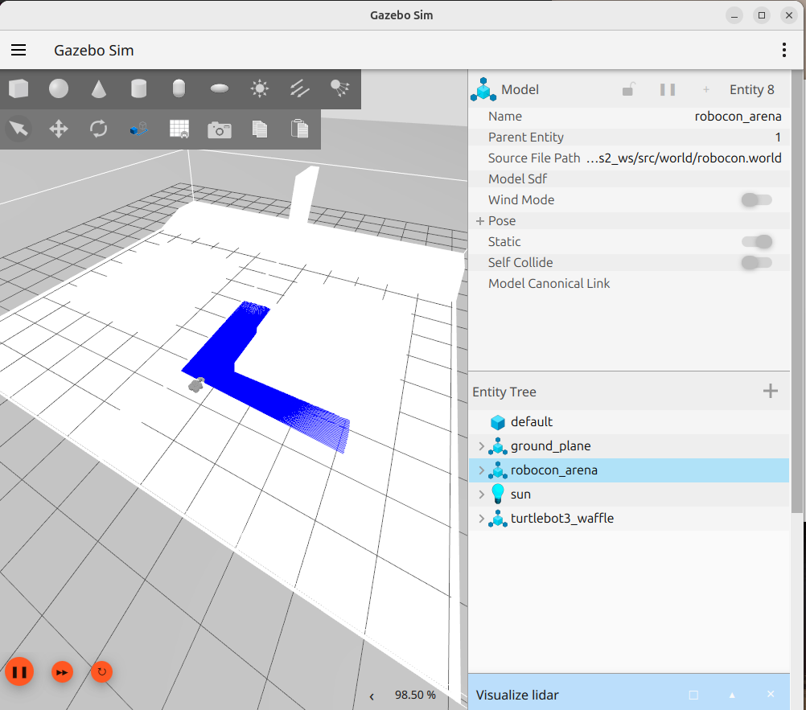
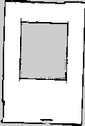
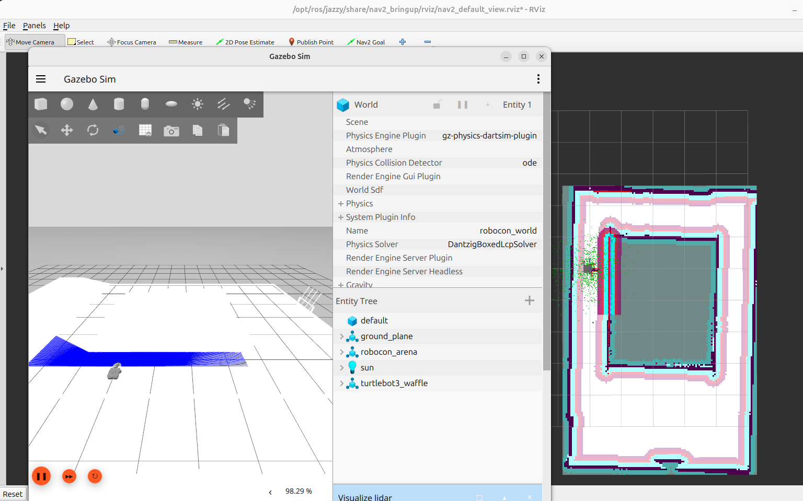

# Robocon 2026: Autonomous Navigation Stack
**Author:** Rudraneel Shee

## Abstract
This project implements a complete autonomous navigation system for a TurtleBot3 robot in **Robocon 2026** arena using **ROS 2 Jazzy**. It features a custom Gazebo simulation world, SLAM-based mapping and autonomous path planning using the **Nav2 stack** with the MPPI Controller.

## Objectives
* **Simulation:** Spawning TurtleBot3 in a custom Robocon Gazebo world
* **SLAM:** Generating a high-quality occupancy grid map of the arena
* **Navigation:** Configuring Nav2 for "Skinny" robot settings to navigate narrow passages

## Tech Stack
* **Framework:** ROS 2 Jazzy Jalisco
* **Simulator:** Gazebo Harmony
* **Navigation:** Nav2 (MPPI Controller), AMCL Localization
* **Mapping:** SLAM Toolbox (Online Async)
* **Robot:** TurtleBot3 Waffle

## Demo




### Simulation
Click to play/download the simulation video
[](./images/Simulation.mp4)

## Installation
### 1. Set up the Workspace
If you don't have a workspace yet, create one:
```bash
mkdir -p ~/ros2_ws/src
cd ~/ros2_ws/src
```
### 2. Clone the Repository
Clone into a temporary folder:
```
git clone https://github.com/EigenRudra/robocon26-ros2-slam-nav.git temp_repo
```

Move all files (scripts, config, maps, etc.) directly to src/
```
cp -r temp_repo/* .
cp -r temp_repo/.gitignore . 
```

Clean up
```
rm -rf temp_repo
```

Make scripts executable
```
chmod +x scripts/fix_robot.sh
```

### 3. Install Dependencies
``` 
cd ~/ros2_ws
sudo apt update
rosdep update
rosdep install --from-paths src --ignore-src -y
```
### 4. Build the Workspace
```
colcon build --symlink-install
```
### 5. Source the Setup File
```
source install/setup.bash
```
### 6. Automatic Sourcing
To avoid running the source command in every new terminal:
```
echo "source ~/ros2_ws/install/setup.bash" >> ~/.bashrc
source ~/.bashrc
```

## Usage Instructions
Open a new terminal for each command below.

### 1. Start the Simulation
Run the master script to launch Gazebo, spawn the robot, and establish all ROS-Gazebo bridges (Clock, TF, Lidar, Velocity, Joints):
```
~/ros2_ws/src/scripts/fix_robot.sh
```

### 2. Launch Autonomous Navigation
```
ros2 launch nav2_bringup bringup_launch.py \
use_sim_time:=True \
map:=~/ros2_ws/src/maps/robocon_map.yaml \
params_file:=~/ros2_ws/src/config/nav2_params.yaml
```

### 3. Localization
1) Open RViz by running the command
```
ros2 run rviz2 rviz2 -d /opt/ros/jazzy/share/nav2_bringup/rviz/nav2_default_view.rviz
```
2) Click "2D Pose Estimate"
3) Point the arrow on the map to match the robot's position in Gazebo.
4) Click "Nav2 Goal" and click a destination on the map.
    The robot should plan a path and move automatically.
    
### Teleoperation
If required, to drive the robot around the arena manually, run the following command
```
ros2 run teleop_twist_keyboard teleop_twist_keyboard
```


   
